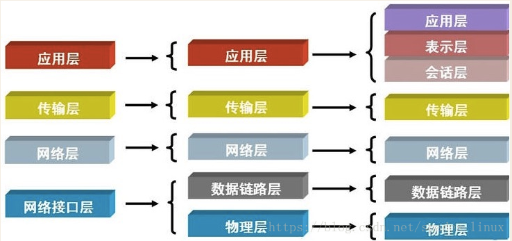
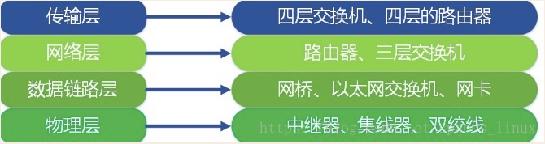
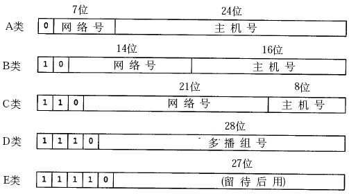
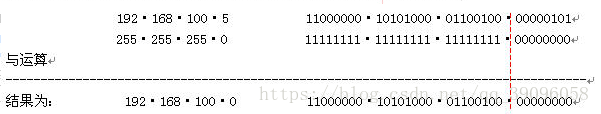
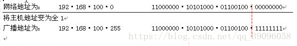
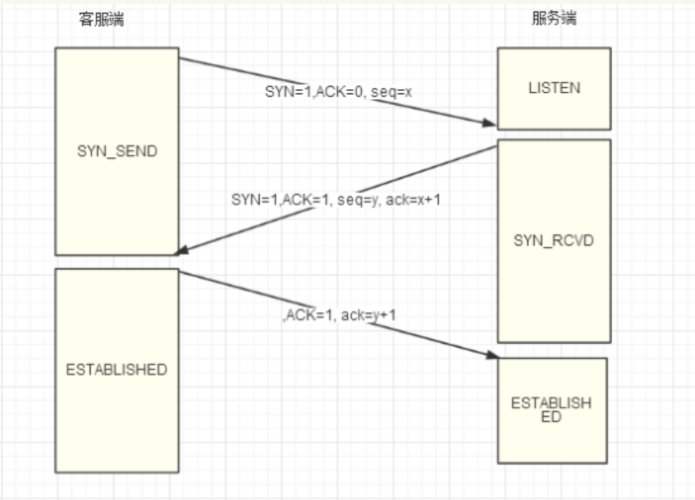
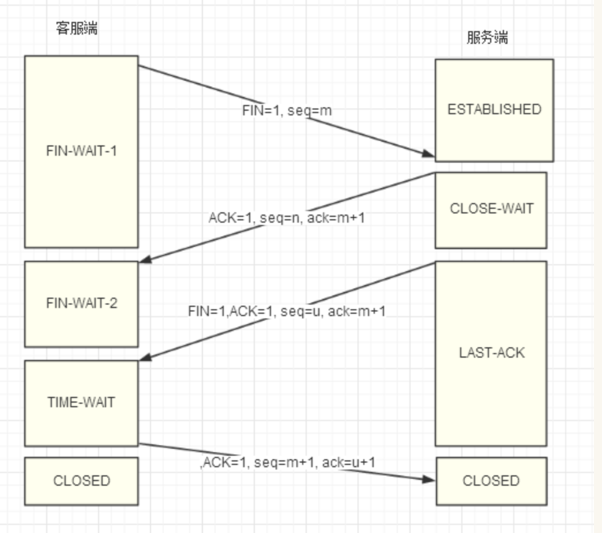

# TCP/IP


## 我们可以将网络模型可以分为OSI七层和TCP/IP五层



每层常见的设备：




# TCP/IP协议的基本框架


```
当通过http发起一个请求时，应用层、传输层、网络层和链路层的相关协议依次对该请求进行包装并携带对应的首部，最终在链路层生成以太网数据包，以太网数据包通过物理介质传输给对方主机，对方接收到数据包以后，然后再一层一层采用对应的协议进行拆包，最后把应用层数据交给应用程序处理。

网络通信就好比送快递，商品外面的一层层包裹就是各种协议，协议包含了商品信息、收货地址、收件人、联系方式等，然后还需要配送车、配送站、快递员，商品才能最终到达用户手中。

一般情况下，快递是不能直达的，需要先转发到对应的配送站，然后由配送站再进行派件。

配送车就是物理介质，配送站就是网关， 快递员就是路由器，收货地址就是IP地址，联系方式就是MAC地址。 

快递员负责把包裹转发到各个配送站，配送站根据收获地址里的省市区，确认是否需要继续转发到其他配送站，当包裹到达了目标配送站以后，配送站再根据联系方式找到收件人进行派件。


即可总结为：
当你输入一个网址并按下回车键的时候，首先，应用层协议对该请求包做了格式定义；紧接着传输层协议加上了双方的端口号，确认了双方通信的应用程序；然后网络协议加上了双方的IP地址，确认了双方的网络位置；最后链路层协议加上了双方的MAC地址，确认了双方的物理位置，同时将数据进行分组，形成数据帧，采用广播方式，通过传输介质发送给对方主机。而对于不同网段，该数据包首先会转发给网关路由器，经过多次转发后，最终被发送到目标主机。目标机接收到数据包后，采用对应的协议，对帧数据进行组装，然后再通过一层一层的协议进行解析，最终被应用层的协议解析并交给服务器处理。
```

## 1.物理层

```
物理层主要考虑的是怎么样才能在连接各种计算机的传输媒体上传输数据比特流，而不是指某个具体的传输媒体。
```

## 2.数据链路层
```
数据链路层的主要功能就是单纯的电信号0和1是没有任何意义的，
必须规定电信号多少为一组，每组是什么意思，
数据链路层就是定义了电信号的分组方式，使数据变得有意义，
这一层的数据单位为帧（frame），现在都用统一的标准分组协议及ethernet

即：对电信号进行分组并形成具有特定意义的数据帧，
然后以广播的形式通过物理介质发送给接收方
```

```
Ethernet规定：
一组电信号构成一个数据包，叫做“帧”
每一组数据帧分为：报头和数据两部分

报头包含（固定18个字节）：
发送者/源地址（mac地址），6个字节
接收者/目标地址（mac地址），6个字节
数据类型，6个字节

数据包含（最短46个字节，最长1500字节）
报头+数据信息=最短64字节/最长1518字节，
超过最大限制就分片进行发送

MAC地址
mac地址是每块网卡的唯一标识，长度为48位的2进制，
通常由12位16进制数表示（前6位是厂商编号，后6位是流水线号）

广播
有了mac地址，同一网络的两台主机就可以通信了（通过arp广播）
```

## 3.网络层

#### IP 地址分为两个部分
  - 网络 ID
  - 主机 ID

####  绝大部分 IP 地址属于以下几类

 - A 类地址：IP 地址的前 8 位代表网络 ID ，后 24 位代表主机 ＩＤ。
- B 类地址：IP 地址的前 16 位代表网络 ID ，后 16 位代表主机 ＩＤ。
- C 类地址：IP 地址的前 24 位代表网络 ID ，后 8 位代表主机 ＩＤ。



```
A类 0.0.0.0到127.255.255.255
B类 128.0.0.0到191.255.255.255
C类 192.0.0.0到223.255.255.255
D类 224.0.0.0到239.255.255.255
E类 240.0.0.0到247.255.255.255
```

#### 通过ip和mac地址计算相关地址    (IP地址为192·168·100·5 子网掩码是255·255·255·0。算出网络地址、广播地址、地址范围、主机数。)

```
子网掩码连续全1的是网络地址，后面的是主机地址
```

- 网络地址




- 广播地址  (将上面的网络地址中的网络地址部分不变，主机地址变为全1，结果就是广播地址)



- 所有主机

```
网络地址+1即为第一个主机地址，广播地址-1即为最后一个主机地址，

由此可以看出 地址范围是： 网络地址+1 至 广播地址-1
本例的网络范围是：192·168·100·1 至 192·168·100·254 
也就是说下面的地址都是一个网段的。

192·168·100·1、
192·168·100·2 
。。。 
192·168·100·20
。。。 
192·168·100·111
。。。 
192·168·100·254
```
- 主机的数量

```
主机的数量=2二进制的主机位数-2

减2是因为主机不包括网络地址和广播地址。本例二进制的主机位数是8位。

主机的数量= 2^8 - 2 = 254
```

## 3.传输层

传输层提供了两种到达目标网络的方式

- 传输控制协议（TCP）：提供了完善的错误控制和流量控制，能够确保数据正常传输，是一个面向连接的协议

```
建立连接通道
数据大小无限制
速度慢，但是可靠性高，有序
```
- 用户数据报协议（UDP）：只提供了基本的错误检测，是一个无连接的协议。

```
把数据打包
数据大小有限制（64k）
不建立连接
速度快，但可靠性低，容易丢包，会乱序
```

### （1）三次握手



```
seq:(Sequence Number)：
本报文段数据的第一个字节的序号

ack:(Acknowledgment Number)：
确认号——期望收到对方下个报文段的第一个数据字节的序号

SYN(synchronize)：
请求同步标志——用于建立和释放连接，当SYN=1时，表示建立连接。

ACK(acknowledge)：
确认标志——仅当 ACK=1时确认号字段才有效。建立 TCP 连接后，所有报文段都必须把 ACK 字段置为 1。

FIN(Finally)：
结束标志——用于释放连接，当 FIN=1，表明发送方已经发送完毕，要求释放TCP连接。

```

- 三次握手流程　

```
1、第一次握手：客户端向服务器端发送连接请求包SYN=1（seq=x），等待服务器回应；

2、第二次握手：服务器端收到请求包后，将客户端的请求包SYN=1（seq=x）放入到自己的未连接队列，此时服务器需要发送两个包给客户端:

　　（1）向客户端发送确认自己收到其连接请求的确认包ACK=1（ack=x+1），向客户端表明已知道了其连接请求

　　（2）向客户端发送连接询问请求包SYN=1（seq=y），询问客户端是否已经准备好建立连接，进行数据通信；

此时服务器进入SYN_RECV状态。

3、第三次握手：客户端收到服务器的包后，知道服务器同意建立连接；向服务器发送连接建立的确认包ACK=1（ack=y+1），回应服务器的SYN（seq=y）告诉服务器，我们之间已经建立了连接，可以进行数据通信。

ACK=1（ack=y+1）包发送完毕，服务器收到后，此时服务器与客户端进入ESTABLISHED状态，开始进行数据传送

```
- 为什么要三次握手
```
握手的过程实际上是在通知对方自己的初始化序号(Initial Sequence Number)，简称ISN，也就是上图中的x和y。x和y会被当作之后传输数据的一个依据，以保证TCP报文在传输过程中不会混乱。

解决两个问题：

1、避免连接请求的数据包丢失

假设连接途中，客户端网络不稳定出现丢包，服务端根据seq=x来确定客户端请求到第几个包。然后告诉客户端你从第seq=x个包开始发送给我，之前的不用发送了，我这里有记录了。

 

2、数据传输过程因为网络并发量很大在某结点被阻塞

传输过程因为网络并发量很大在某结点被阻塞了，Server端将先后收到2次请求，并持续等待两个Client请求向他发送数据，但是Cient端实际上只有一次请求，而Server端却有2个响应，极端的情况可能由于Client端多次重新发送请求数据而导致Server端最后建立了N多个响应在等待，因而造成极大的资源浪费！

三次握手的seq与ack确定了包的顺序。客户端每次请求时，询问服务端说这是第一号包，服务端收到后告诉客服端下次你给我的只能是二号包（别的都不要），同时给返回到客户端的包作标记：这是我返回给你的一号包。这样，出现阻塞时，根据包的序号就知道要响应的是几号包。
```

### (2) 四次挥手流程



- 详解

```
(1)Client向Server发送断开连接请求的报文段，seq=m(m为Client最后一次向Server发送报文段的最后一个字节序号加1)，Client进入FIN-WAIT-1状态。

(2)Server收到断开报文段后，向Client发送确认报文段，seq=n(n为Server最后一次向Client发送报文段的最后一个字节序号加1)，ack=m+1，Server进入CLOSE-WAIT状态。此时这个TCP连接处于半开半闭状态，Server发送数据的话，Client仍然可以接收到。

(3)Server向Client发送断开确认报文段，seq=u(u为半开半闭状态下Server最后一次向Client发送报文段的最后一个字节序号加1)，ack=m+1，Server进入LAST-ACK状态。

(4)Client收到Server的断开确认报文段后，向Server发送确认断开报文，seq=m+1，ack=u+1，Client进入TIME-WAIT状态。

(5)Server收到Client的确认断开报文，进入CLOSED状态，断开了TCP连接。

(6)Client在TIME-WAIT状态等待一段时间(时间为2*MSL((Maximum Segment Life))，确认Client向Server发送的最后一次断开确认到达(如果没有到达，Server会重发步骤(3)中的断开确认报文段给Client，告诉Client你的最后一次确认断开没有收到)。如果Client在TIME-WAIT过程中没有再次收到Server的报文段，就进入CLOSES状态。TCP连接至此断开。
　　
```

- 为什么要四次挥手？
- 
```
tcp关闭连接需要四次握手原因：TCP连接是全双工通道，需要双向关闭。

client向server发送关闭请求，表示client不再发送数据，server响应。此时server端仍然可以向client发送数据，待server端发送数据结束后，就向client发送关闭请求，然后client确认
```
